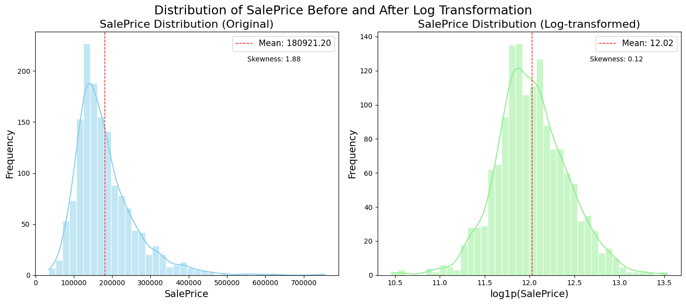

# House Prices: Advanced Regression Analysis & Feature Engineering

## Dataset Overview
**Name:** House Prices - Advanced Regression Techniques (Kaggle)
**Description:** A comprehensive dataset containing 1,460 observations and 81 features describing (almost) every aspect of residential homes in Ames, Iowa. The goal is to predict the final price of each home (**SalePrice**).

---

## 5 Key Findings
1.  **Overall Quality is King:** `OverallQual` shows the strongest positive correlation (~0.79) with `SalePrice`, confirming that material and finish quality are the primary drivers of value.
2.  **Size Matters (Linearly):** Above-ground living area (`GrLivArea`) and `TotalBsmtSF` exhibit a strong linear relationship with price, though outliers exist where large homes sold for unexpectedly low prices.
3.  **Skewness in Target:** The `SalePrice` distribution is significantly right-skewed. Applying a `log1p` transformation successfully normalized the target, which is critical for linear modeling.
4.  **Neighborhood Premium:** Median prices vary drastically across neighborhoods (e.g., NoRidge and NridgHt vs. OldTown), suggesting that location-based frequency encoding or dummy variables are essential.
5.  **Age vs. Value:** There is a clear negative trend between `HouseAge` and `SalePrice`, though heavily remodeled older homes can rival the value of newer constructions.

---

## Top 3 Features Engineered
1.  **TotalSF (Total Square Footage):** Combined `TotalBsmtSF`, `1stFlrSF`, and `2ndFlrSF`. This aggregate area feature outperformed individual area metrics in correlation rankings.
2.  **QualCond (Quality-Condition Interaction):** A product of `OverallQual` and `OverallCond`. This captured the synergy where a high-quality house in excellent condition commands a disproportionate premium.
3.  **HouseAge:** Calculated as `YrSold - YearBuilt`. This simplified the temporal data into a continuous "years old" metric that linear models can interpret more effectively than raw dates.

---

## Tools Used
* **Data Manipulation:** `Pandas`, `NumPy`
* **Visualization:** `Matplotlib`, `Seaborn`
* **Statistical Analysis:** `SciPy` (skewness, box-cox)
* **Machine Learning Preprocessing:** `Scikit-Learn` (StandardScaler, RobustScaler, OneHotEncoder)

---

## Analysis Dashboard

*Note: The dashboard above visualizes the distribution of SalePrice, correlations of engineered features, and the impact of feature scaling on key variables.*
